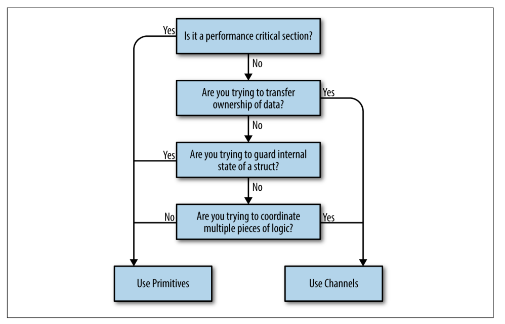

***Channels***
```
ch := make(chan int)
ch <- x // send x
x = <- ch // receive x
close(ch)
x, ok = ch // ok is false if closed
```
```
func rangeExample(){
	intStream := make(chan int)
	go func intData(){
		defer close(intStream)
		for i := 0; i < 5; i++ {
			intStream <- i 
		}
	}
	for v := range intStream { // automatically stops when gets to close stream
		fmt.Println(v)
	}
    // can use this as a way to unblock multiple goroutines simultaneously. 
}
```
Lexical scoping 
```
func channelOwner() <- chan int {
    c := make(chan int, 5) // write all to buffer then exit
    go func(){
        defer close(c)
        for i := 0; i < 5; i++ {
            c <- i
        }
    }()
    return c
}
```
***Unidirectional channels***
```
func squarer(out chan<- int, in <-chan int) {
    for v := range in {
        out <- v * v
    }
    close(out)
}
```

***Buffered channels***
```
ch = make(chan string, 3)
```


Select
```
select {
    case <- ch1: 
    case x := <- ch2:
    case <- time.After(1 * time.Second): // elegant way to do timeout
        fmt.Println("timed out") 
    default: // only use in for-select loop to keep making progress
}
```
Go runtime will try to read uniformly from all the channels in the select statement.

***Or channels***
```
var or func(channels ...<- chan interface{}) <- chan interface{}
```
Combine channels into one. 

Consider writing helper functions to make code easier to read such as or-done channel wrapper on page 120.

***Fan-in/fan-out***
If one part of your pipeline is computationally slow can have multiple goroutines read from the same channel or can 
have multiple goroutines write to the same channel. 
Fanning out = Implementation just create multiple versions of that goroutine that reads from that channel. 
Fanning in = Just use select statement

***Tee channel***
```
for val := range orDone(done, in) {
    var out1, out2 = out1, out2
    for i := 0; i < 2; i++ { // non-blocking iterations 
        select {
            case <- done:
            case out1 <- val:
                out1 = nil
            case out2 <- val
                out2 = nil
        }
    }
}
```

***Internal representation***
* Channels are used for communication between goroutines and can be used to send and receive values enabling synchronization and data exchange.
* Two main types 1. Unbuffered: block the sending goroutine until the other goroutine receives the value 2. buffered channels have capacity and only block when the buffer is full (on send) or empty (on receive)

Trade-off between buffered and unbuffered channels
* Advantages of unbuffered channels 1. direct synchronization 2. guaranteed communication 3. design clarity
* Advantages of buffered channels 1. increased deadlock potential

`hchan`
* References to goroutines that are waiting to send and receive from the channel
* Channel operations are guarded by a lock to manage synchronization
* There is a buffer to store the buffered channel

* Send = 1. check if waiting receiver if so - transfers the data resuming both. 2. If no receiver and buffered space available then store item and continue 3. o/w block
* Receive = 1. check if buffer empty if not take value and continue 2. if buffer empty and waiting sender then take value 3. if no sender then wait.

Closed channels
* No buffered data is lost it just means no more data will be sent
* You can still receive from a closed channel it just returns immediatley with the false value (or for single value return the zero-value)
* Be careful about closign a channel concurrently and then trying to still send data on it